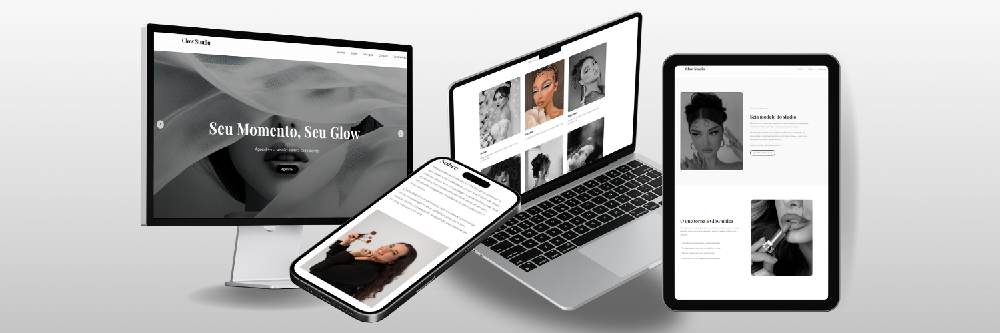

# Glow Studio

  

Interface de alta fidelidade desenvolvida para o segmento de estética de luxo, com foco em experiência do usuário (UX) e conversão estratégica. O projeto apresenta uma solução completa para apresentação de serviços de maquiagem, cabelos e massagens, unindo performance técnica à sofisticação visual.

## Diferenciais do Projeto

### Arquitetura Responsiva

Desenvolvimento focado em adaptabilidade total. A interface utiliza lógica de detecção de viewport para garantir que elementos críticos, como o banner principal e o catálogo de serviços, mantenham a hierarquia visual em dispositivos móveis e desktops.

### Componentização e UI

- **Efeito de Interação Dinâmica:** Implementação de filtros de saturação aplicados via CSS que transicionam de escala de cinza para colorido no estado de foco (hover).
- **Geolocalização Customizada:** Integração de mapas com tratamento visual para manter a consistência com a paleta de cores da marca.
- **Fluxo de Conversão:** Seções estrategicamente posicionadas para parcerias com influenciadores e agendamento direto.

## Tecnologias Utilizadas

### Core

- **React 19:** Biblioteca principal para construção da interface.
- **Vite:** Ferramenta de build para otimização do tempo de carregamento e desenvolvimento.

### Bibliotecas e Ferramentas

- **Lucide React:** Iconografia vetorial de traços finos e minimalistas.
- **CSS-in-JS:** Estilização modular para controle preciso de estados dinâmicos.
- **ESLint:** Padronização e qualidade do código fonte.

## Estrutura de Componentes

O projeto foi organizado de forma modular para facilitar a manutenção e escalabilidade:

- **Hero:** Slider adaptativo com controle de profundidade.
- **Services:** Grid interativo de categorias de beleza.
- **InfluencerCTA:** Módulo focado em marketing de influência.
- **Diferenciais:** Exposição da proposta de valor da marca.
- **Contact:** Centralização de canais de atendimento e localização.

## Instalação e Uso

Para executar o projeto localmente, siga os passos abaixo:

1. Clone o repositório:
   git clone https://github.com/debbsouz/glow-studio-website.git

2. Instale as dependências:
   npm install

3. Inicie o servidor de desenvolvimento:
   npm run dev

## Deploy

O projeto está disponível para visualização online em:
[https://debbsouz.github.io/glow-studio-website/](https://debbsouz.github.io/glow-studio-website/)

## Licença

Este projeto foi desenvolvido para fins de portfólio profissional. Todos os direitos de design e imagem pertencem aos seus respectivos proprietários.
